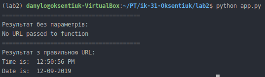
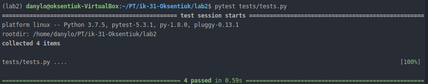

# Lab_2: Автоматизація. Знайомство з CI/CD.

1. Ствоюю папку `lab2` з `README.md` файлом.
2. За допомогою пакетного менеджера PIP інсталюю `pipenv` та створюю ізольоване середовище для Python. Ознайомлююся з командаю `pipenv -h`.
    ```
    pip install pipenv
    pipenv --python 3.7
    pipenv shell
    ```

3. Встановлюю бібліотеку `requests` у середовищі. Також встановіть бібліотеку `ntplib`, яка працює з часом:
    ```
    pipenv install requests
    pipenv install ntplib
    ```
   
4. Створюю файл `app.py` і копіюю код програми із репозиторію до себе.
5. Переконуюся, що програма працює правильно, виконавши команду:
   ```
   python app.py
   ```
   
   
   
6. Встановлюю бібліотеку `pytest`, виконавши команду:
      ```
      pipenv install pytest
      ```
   
7. Копіюю приклади тестів та виконую їх командою 
     ```
     pytest tests/tests.py
     ```
     - Виконую тести: 
     
    

8. У програмі дописую функцію, яка буде перевіряти час доби `AM/PM` та відповідно друкувати: `Доброго дня/ночі`.
9. Пишу тест, що буде перевіряти правильність виконання функції.
10. Використовую команди `>` та `>>`. Для того, щоб перенаправити результати виконання тестів пишу `pytest tests/tests.py > results.txt`. Для того, щоб додати результат програми: `python app.py >> results.txt`.
11. Зроблю коміт із змінами до репозиторію.
12. Заповню `Makefile` для повної автоматизації процесу СІ проекту.
13. Комічу зміни в `Makefile` до репозиторію.
14. На віртуальній машині Ubuntu запускаю `make`:
    ```
    make
    ```
    