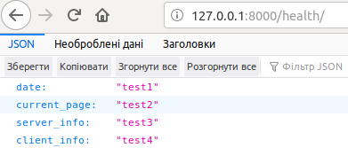

# Lab_3: Вступ до моніторингу.

1. Створюю папку `lab3` у власному репозиторію. Перейшовши у папку ініціалізовую середовище `pipenv` та встановлюю необхідні пакети:
    ```
    pipenv --python 3.7
    pipenv install django
    ```
2. За допомогою Django Framework створюю заготовку проекту `osite`. Для зручності виношу всі створені файли на один рівень вище:
    ```
    pipenv run django-admin startproject osite
    mv osite/osite/* osite/
    mv osite/manage.py ./
    ```
    