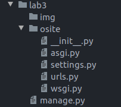
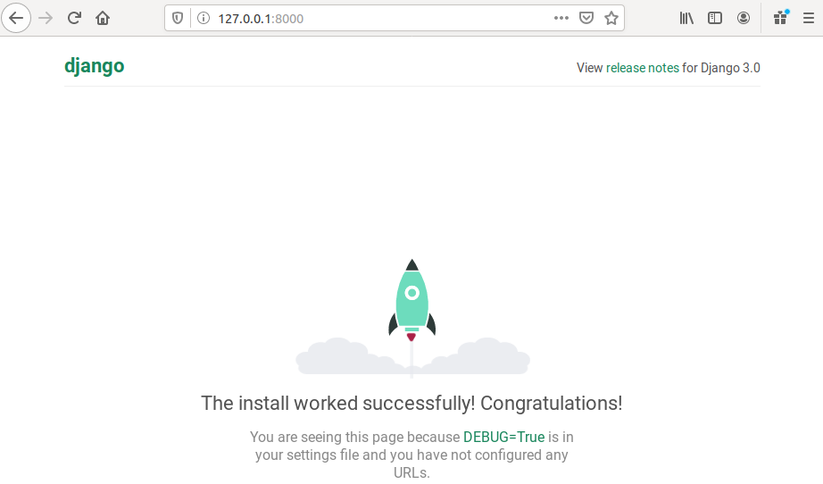
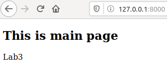
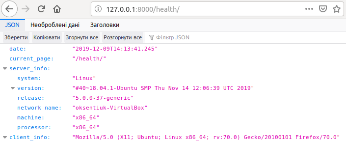

# Lab_3: Вступ до моніторингу.

1. Створюю папку `lab3` у власному репозиторію. Перейшовши у папку ініціалізовую середовище `pipenv` та встановлюю необхідні пакети:
    ```
    pipenv --python 3.7
    pipenv install django
    ```
2. За допомогою Django Framework створюю заготовку проекту `osite`. Для зручності виношу всі створені файли на один рівень вище:
    ```
    pipenv run django-admin startproject osite
    mv osite/osite/* osite/
    mv osite/manage.py ./
    ```
    

3. Переконуюсь, що все встановилось правильно і можна запустити `Django` сервер. Виконую команду вказану нижче та переходжу за посиланням яке вивелось у консолі:
    ```
    pipenv run python manage.py runserver
    ```
   
   
4. Зупиняю сервер, виконавши переривання `Ctrl+C`. Створюю коміт із базовим темплейтом сайту.
5. Далі створюю темплейт додатку (app) у якому буде описано всі web сторінки сайту. Створюю коміт із новоствореними файлами темплейту додатка:
     ```
     pipenv run python manage.py startapp main
     ```
6. Використовуючи можливості `IntelliJ` створюю папку `main/templates/`, файл main.html у цій папці та файл `urls.py`. Роблю коміт з даними файлами.
7. Вказую `Django frameworks` назву додатку та де шукати його веб-сторінки у файлах `osite/setting.py` та `osite/url.py` відповідно.
8. Заповнюю вміст файлу `main/views.py` для відображення `.html` темплейта та сторінки, що повертає відповідь у форматі `JSON`.
9. Заповнюю файл `main/urls.py` згідно зразка, щоб поєднати функції з реальними URL шляхами, за якими будуть доступны веб-сторінки.
10. Запускаю сервер, щоб переконатися, що сторінки доступні. Виконую коміт робочого Django сайту. 

    

11. Встановлюю необхідну для моніторингу бібліотеку за допомогою команди 
    ```
    pipenv install requests
    ```
12. Відкриваю сторінку `/health` у браузері:

    

13. Виконую задачі лабораторної роботи:
    
    - модифікую функцію health так, щоб у відповіді були: згенерована на сервері дата, URL сторінки моніторингу, інформація про сервер на якому запущений сайт та інформація про клієнта який робить запит до сервера:
    
        
     
     - дописую функціонал який буде виводити повідомлення про недоступність сайту у випадку якщо WEB сторінка недоступна;
     
     - роблю так, щоб програма моніторингу запускалась раз в хвилину та працювала в бекграунді;
     
     - додаю аліас на запуск сервера, який тепер буде стартувати за командою pipenv run server, та аліас на запуск моніторингу командою monitoring.