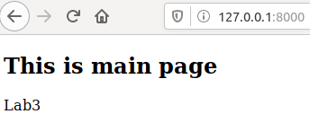

# Lab_5: Автоматизація за допомогою Makefile VS Docker Compose

1. Створюю папку `my_app`, в якій буде знаходитись проект. Створюю папку `tests` де будуть тести на перевірку працездатності проекту. Копіюю файли з репозиторію у відповідні папки мого репозиторію. Переглядаю файл `requirements.txt` у папці проекту та тестах.
2. Перевіряю чи проект є працездатним. Ініціалізувавши середовища, виконую наступні команди:
    ```
    pipenv --python 3.7
    pipenv install -r requirements.txt
    pipenv run python app.py
    ```
   - Виправляю помилку `redis.exceptions.ConnectionError`, що виникла при спробі запустити додатку;
   - Переконуюся, що головна сторінка працює:
      
     
     
    - Створюю папку `logs` для того, щоб працювали сторінки `/hits` та `/logs`. Переконуюся, що після цього вони працюють:
   
        
   
        
        
3. Ініціалузовую середовище для тестів у іншій вкладці терміналу та запускаю їх командою:
     ```
     pipenv run pytest test_app.py --url http://localhost:5000
     ```
   - Тести виконалися успішно:
   
    
    
    - Видаляю файли `Pipfile` та `Pipfile.lock`.
    
 4. Створюю два `Dockerfile` та `Makefile`, який допоможе автоматизувати процес розгортання.
 5. Ознайомлююся із вмістом Dockerfile та Makefile та його директивами:
     
     - `STATES` та `REPO` це змінні, які містять назви тегів та назву репозиторія `Docker Hub` відповідно;
     - `.PHONY `- утиліта `make`, яка вказує файлу, що переліченні нище цілі не являються файлами;
     - `$(STATES)` можна викликати просто підставляючи назву тегу і призначена для білду `Docker Image`;
     - `run` - ціль для створення мережі, у якій буде працювати додаток; запуску додатку і `redis`;
     - `test-app` для запуску тестів;
     - `docker-prune` для очищення ресурсів Docker.
 6.  Виконую наступну команду для створення `Docker` імеджів для додатку та для тестів:
     ```
     make .PHONY
     ```
7. Запускаю додаток та тести, виконавши команди: 
    ```
    make run
    make test-app
    ```
   - Перевіряю кожну сторінку сайту:
   
     
     
     
     
     
     
   - Результат виконання тестів:
   
     

8. Очищаю всі ресурси Docker за допомогою команди:
    ```
    make docker-prune
    ```
9. Створюю директиву в `Makefile` для завантаження створених імеджів у `Docker Hub` репозиторій. Завантажую імеджі до репозиторію командою:
    ```
    make docker-push
    ```
   
   - [Посилання на Docker Hub](https://hub.docker.com/repository/docker/legeia/lab5_devops);
   
10. Створюю директиву `delete-images` в `Makefile`, яка автоматизує процес видалення імеджів. Після виконання команди переконуюся, що імеджів немає:
     
       

11. Створюю файл `docker-compose.yml` у папці проекту та заповнюю вмістом згідно прикладу. У нього з'являється дві мережі: `secret` і `public`:
     - У мережі `secret` знаходяться `app` і `redis`;
     - До мережі `public` відносяться `app` і `tests` ;
     - Таким чином `tests` i `redis` не мають доступу один до одного.
     
12. Перевіряю чи `Docker-compose` встановлений та працює у  системі, а далі просто запускаю `docker-compose` командою:
    ```
    docker-compose version
    docker-compose -p lab5 up
    ```

13. Перевіряю чи працює веб-сайт. Для цього переходжу за адресою `http:/127.0.0.1/`:

     
     
     
     
     

14. Перевіряю чи компоуз створив докер імеджі . Імеджі мають `compose-tests` і `compose-app`. Змінюю їх на власний репозиторій `legeia/lab5_devops` і перезапускаю `docker-compose`, очистивше імеджі без тегів за допомогою директиви в `Makefile`:
    
    
    
15. Зупиняю проект, натиснувши `Ctrl+C`, і очищаю ресурси створені компоуз `docker-compose down`.

16. Завантажую створені імеджі до `Docker Hub` репозиторію за допомого команди:
    ```
    docker-compose push
    ```
17. На мою думку, як `docker-compose.yaml`, так і `Makefile` хоча і мають схожу сферу використань, але використовуються у різних ситуаціях:

    - `Makefiles` є інструментом збирання, принцип якого простий: для побудови цілі необхідно вказати залежності та команди для її побудови. Можуть виникнути складнощі;
    - За допомогою `docker-compose` можна визначити багатоконтейнерну структуру в одному файлі, потім працювати з своєю програмою виконуючи лише одну команду, яка робить усе необхідне для її запуску, зупинки і деплою.

18. Створюю `docker-compose.yml` для лабораторної №4:
    
       - `docker-compose.yml` створює два імеджі для Django сайту та моніторингу ([docker-compose.yaml файл знаходиться тут](https://github.com/legeia/ik-31-Oksentiuk/tree/master/lab4/docker-compose.yml);
    
       - Запускаю docker-compose.yaml командою:
            ```
            docker-compose -p lab4 up
            ```
       - Перевіряю доступність головної сторінки та вкладки `health`:
       
            
       
            
       
       - Зупиняю проект, натиснувши Ctrl+C, і очищаю ресурси створені компоуз `docker-compose down`. Витягую файл `server.log`;

       - Завантажую створені імеджі до Docker Hub репозиторію за допомого команди ([Посилання на Docker Hub](https://hub.docker.com/repository/docker/legeia/lab4_devops);):
           ```
           docker-compose push
           ```   
         