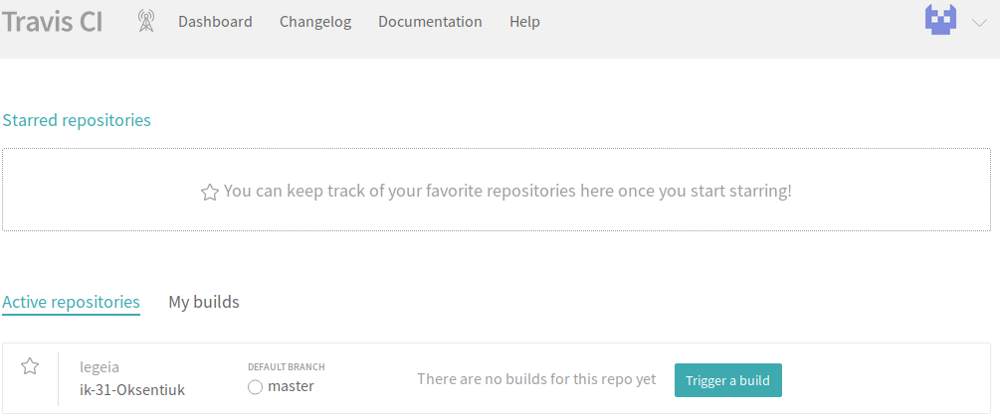
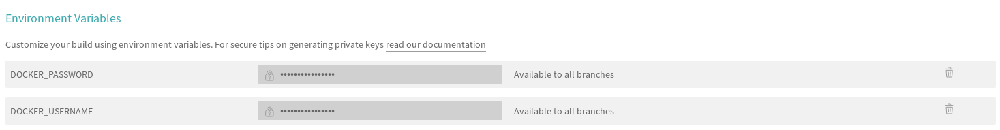

# Lab_6: Автоматизація за допомогою CI/CD серверів.

1. Реєструюся на сайті `Travis` - використовую вхід за допомогою `GitHub` креденшалів. Додаю свій репозиторій:

     
     
2. Для того, щоб `Travis` знав, які кроки потрібно виконати над кодом у кореневій папці репозиторію використовується файл `.travis.yml`. Створюю у свому `GitHub` репозиторію такий самий файл та копіюю туди вміст з репозиторію `devops_course`.

3. Для того, щоб налаштувати інтеграцію з `Docker Hub`, створюю змінні середовища для авторизації:

    

4. Оскільки білд представлений у репозиторії `devops_course` не враховує всі попередні домашні завдання, тому:
   
      - переписую білд `lab2`, з використання кроків записаних у `Makefile`;
      - переписую білд `lab4`, з ще одним `DockerFile` для контейнера моніторингу;
      - переписую білд `lab5` і додаю кроки `Makefile`, які робили `push` імеджів у `Docker Hub` репозиторій;
      - всі білди виконуються успішно:

5. [Посилання на Travis build](https://travis-ci.org/legeia/ik-31-Oksentiuk)